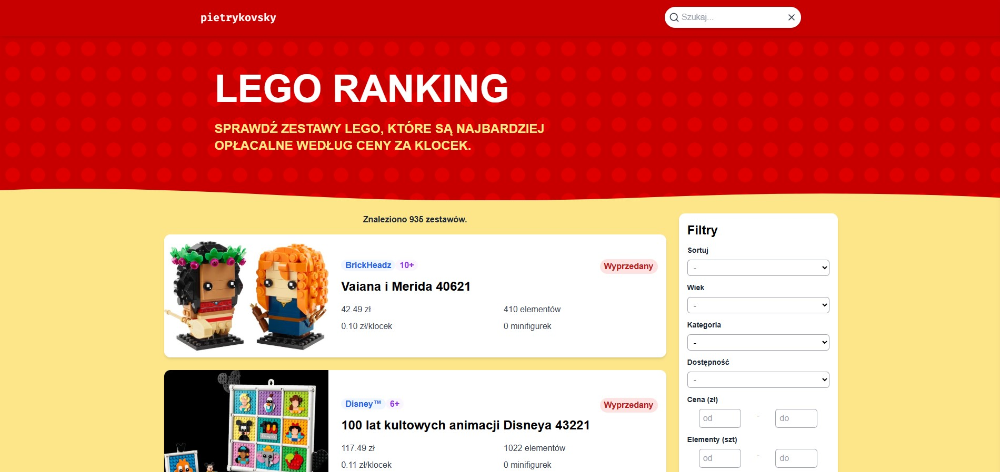

# Lego Ranking App

A fullstack application for viewing and ranking LEGO sets developed in REST methodology. This application helps users find the most cost-effective LEGO sets by analyzing price per element ratios and providing comprehensive filtering options.

## Preview



- [Live Website](https://lego-ranking.pietrykovsky.com/)

## Features

### Frontend

- Interactive interface for browsing LEGO sets
- Advanced filtering and sorting capabilities
- Real-time search functionality
- Responsive design for all devices
- Dynamic pagination
- Mobile-friendly sidebar filters
- Theme and age category filtering
- Availability status indicators

### Backend

- RESTful API endpoints for LEGO set data
- Automated data scraping from official LEGO store
- Background tasks for periodic updates
- Image processing and optimization
- PostgreSQL database for data storage
- Redis for task queue management
- Swagger API documentation
- Health check endpoints
- Customized admin panel for data management

### Data Management

- Automated LEGO set data collection
- Price per element ratio calculations
- Image optimization and storage
- Periodic database updates
- Theme and age category organization

## Tech Stack

### Frontend

- Next.js 15.1
- React 19.0
- TypeScript 5.7
- Tailwind CSS 3.4

### Backend

- Python 3.13
- Django 5.1
- Django REST Framework
- Celery
- Redis
- PostgreSQL
- Selenium

### DevOps

- Docker
- Docker Compose
- Poetry (Python dependency management)
- npm (Node.js dependency management)

## Prerequisites

- Docker and Docker Compose
- Python 3.13 (for local development)
- Node.js 22.12 (for local development)
- Git

## Project Structure

```
lego-ranking-app/
├── frontend/           # Next.js frontend application
├── backend/           # Django backend application
├── compose.yml        # Docker Compose configuration
├── .env.sample        # Environment variables template
└── README.md         # This file
```

## Installation

1. Clone the repository:

```bash
git clone https://github.com/pietrykovsky/lego-ranking-app.git
cd lego-ranking-app
```

2. Create and configure environment variables:

```bash
cp .env.sample .env
```

Edit the `.env` file with your desired configuration:

```env
DEBUG=false

DJANGO_SECRET_KEY='your-secure-secret-key'
DJANGO_ALLOWED_HOSTS=127.0.0.1,0.0.0.0,localhost,lego-ranking-frontend,lego-ranking-backend,lego-ranking-frontend:3000
CORS=http://127.0.0.1:3000,http://0.0.0.0:3000,http://localhost:3000,http://lego-ranking-frontend:3000,http://lego-ranking-backend:8000
DJANGO_SETTINGS_MODULE=core.settings

REDIS_CLOUD_URL=redis://redis:6379

POSTGRES_DB=your_database_name
POSTGRES_USER=your_database_user
POSTGRES_PASSWORD=your_secure_password

NODE_ENV=production
API_URL="http://lego-ranking-backend:8000/api"
```

3. Build the project:

```bash
docker compose build
```

## Usage

1. Start the application:

```bash
docker compose up
```

2. Access the applications:

   - Frontend: http://localhost:3300
   - Backend API: http://localhost:8000/api
   - API Documentation: http://localhost:8000/api/docs
   - Admin Panel: http://localhost:8000/admin

3. Create an admin user:

```bash
docker compose run --rm backend python manage.py createsuperuser
```

4. Stop the application:

```bash
docker compose down
```

## Development

For local development, each component can be run separately. See the respective README files in the frontend and backend directories for detailed instructions:

- [Frontend Guide](frontend/README.md)
- [Backend Guide](backend/README.md)

## Services

The application consists of several services that can be managed via Docker Compose:

- `frontend`: Next.js web application
- `backend`: Django REST API
- `db`: PostgreSQL database
- `redis`: Redis for task queue
- `celery`: Celery worker for background tasks
- `beat`: Celery beat for scheduled tasks

## License

This project is licensed under the MIT License - see the [LICENSE](LICENSE) file for details.
